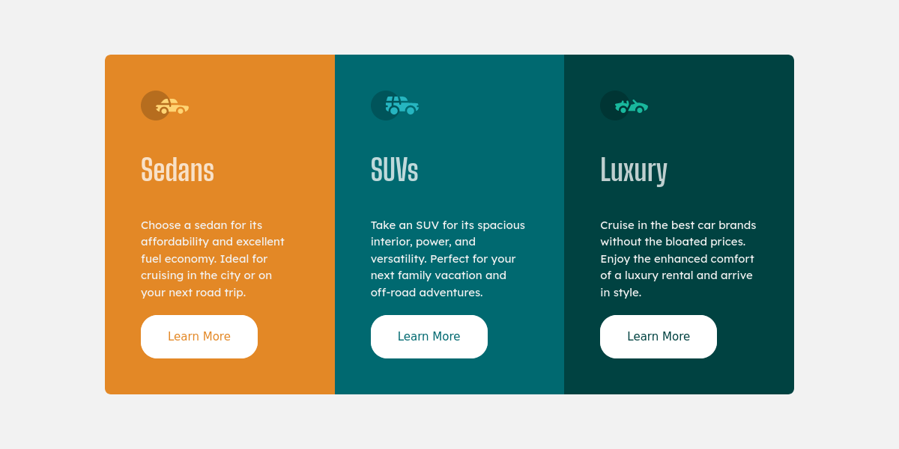

# Frontend Mentor - 3-column preview card component solution

### Screenshot



### Links

- Solution URL: [Soluti](https://colum-preview-lovat.vercel.app/)
- Live Site URL: [LiveSiteURL](https://colum-preview-lovat.vercel.app/)

## My process

### Built with

- Semantic HTML5 markup
- CSS custom properties
- Flexbox
- CSS Grid
- Mobile-first workflow

### What I learned

Use this section to recap over some of your major learnings while working through this project. Writing these out and providing code samples of areas you want to highlight is a great way to reinforce your own knowledge.

To see how you can add code snippets, see below:

```html
<h1>Some HTML code I'm proud of</h1>
```
```css
.proud-of-this-css {
  color: papayawhip;
}
```
```js
const proudOfThisFunc = () => {
  console.log('🎉')
}
```

### Continued development

Use this section to outline areas that you want to continue focusing on in future projects. These could be concepts you're still not completely comfortable with or techniques you found useful that you want to refine and perfect.

## Author

- Website - [Birusha Ndegeya](https://myportfolio-chi-mocha.vercel.app/)
- Frontend Mentor - [@birushandegeya](https://www.frontendmentor.io/profile/BirushaNdegeya)
- Twitter - [@BirushaNdegeya](https://www.twitter.com/BirushaNdegeya)